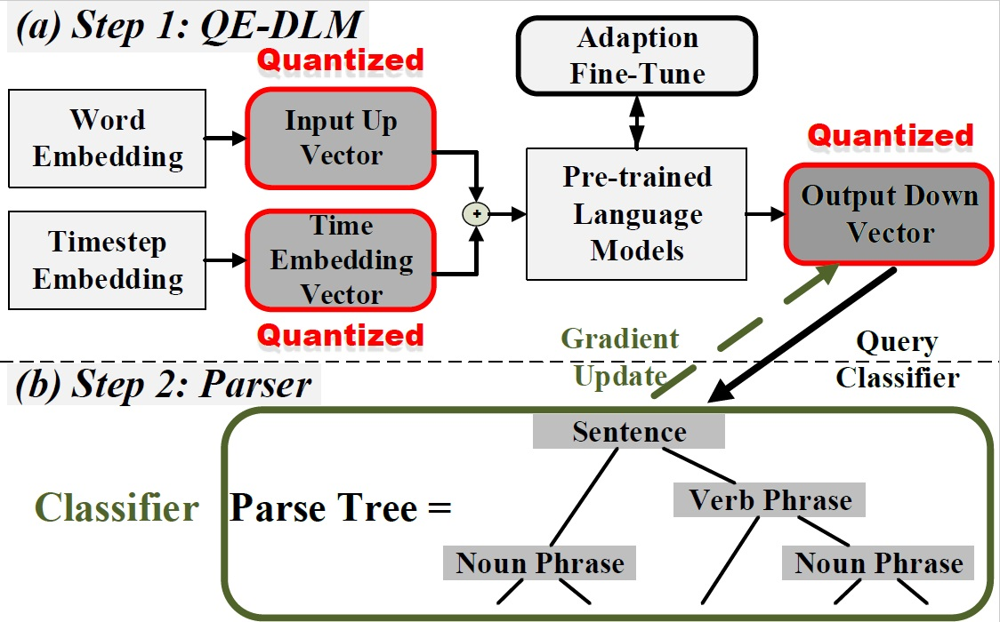

# Using Quantized Embedding Vectors to Optimize Controllable Diffusion Language Models


## Overview

This is the official repo for the paper: [Quantized Embedding Vectors for Controllable Diffusion Language Models](https://arxiv.org/abs/2402.10107).

> QE-Diffusion Controllable LM is based on a Controllable Diffusion Language Model whose latent space is modeled by the 
> Denoising Diffusion Probabilistic Model (DDPM), constrained by task requirement (such as, topic, grammar, length and 
> so on), and modified by the rounding process to bridge the discrete text and the continuous input. Quantization process, 
> especially fixed-quantization on embedding vectors can decease the complexity of Controllable DLM's embedding space. 
> But it cannot improve DLMs because their embedding space need higher complexity. Compared to previous controllable 
> text generation models, this method not only can decease the 
> perplexity of generated text, but also can theoretically accelerate the inference speed.  

## The limitation of Controllable Diffusion Language Models

"There are drawbacks to the Diffusion-LMs that we constructed: (1) it has higher perplexity; (2) decoding is substantially slower; and (3) training converges more slowly."


## The solutions
The proposed method contains two main steps: QEDLM and Classifier. In the first step, QE-DLM denoises a sequence of quantized Gaussian vectors that are added to word vectors. The quantized embedding vectors then compress and remodel the discrete latent space through a reverse diffusion process. In the second step, the Classifier updates the gradient on the continuous latent space using control. The DLM demonstrates its capability to generate fluent text, and the proper classifier effectively constrains the generated text based on specific control dependence, such as a Parse Tree.

<div align="center">
    <figure>
        
    </figure>
</div>

## Requirements

```
pip install pytorch torchvision torchaudio cudatoolkit=11.3 -c pytorch
pip install -e improved-diffusion/ 
pip install -e transformers/
pip install -e loralib/
pip install spacy
pip install datasets 
pip install huggingface_hub
pip install wandb
```

-----------------------------------------------------
## Train Diffusion-LM with Quantized Enbeddings:

```
cd improved-diffusion
mkdir diffusion_models
```

```
cd Q-Controllable-DLM/batch_file
sbatch DiffLM_Quantized_fixed04_e2e.batch
sbatch DiffLM_Quantized_fixed04_ROCStory.batch
sbatch DiffLM_Quantized_fixed04_WikiText103.batch
```

## Acknowledgement
This code is based on [Contrtollable Diffusion Language Model](https://github.com/XiangLi1999/Diffusion-LM) and [Improve Diffusion](https://github.com/openai/improved-diffusion). Thanks for their wonderful works.


-----------------------------------------------------

For details of the methods and results, please refer to our paper. 


```bibtex
@article{kang2024quantized,
  title={Quantized Embedding Vectors for Controllable Diffusion Language Models},
  author={Kang, Cheng and Chen, Xinye and Hu, Yong and Novak, Daniel},
  journal={arXiv preprint arXiv:2402.10107},
  year={2024}
}
```

